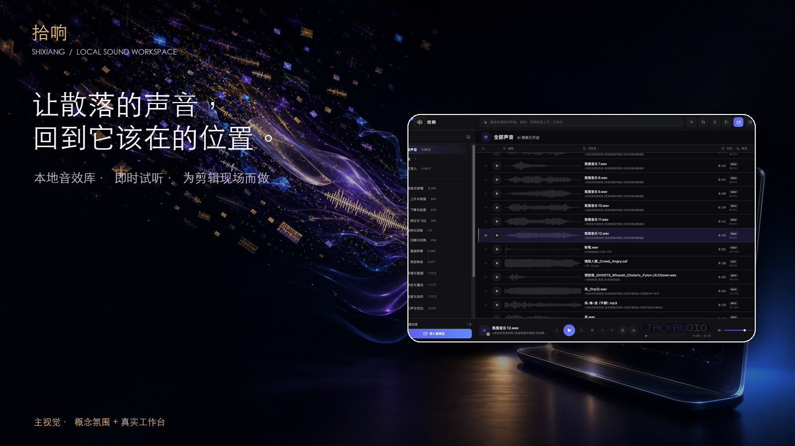
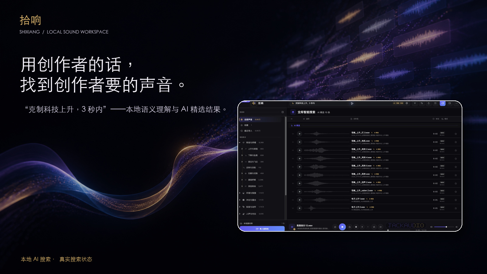
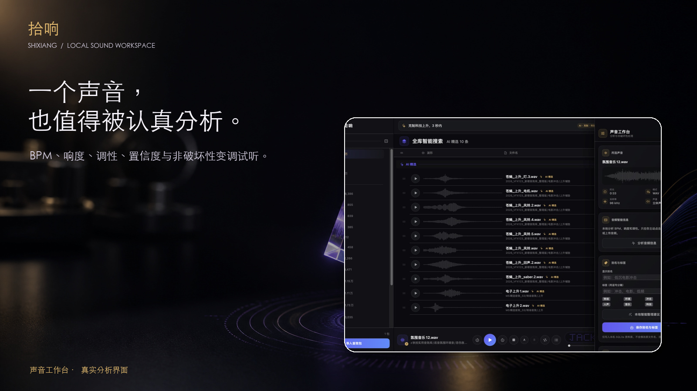
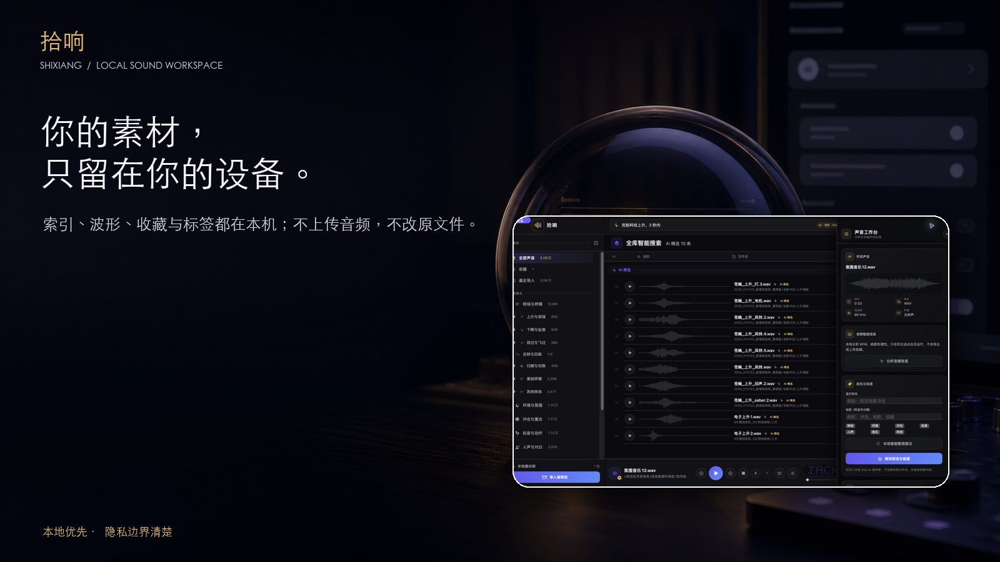

# 拾响 Shixiang

> 让散落的声音，回到它该在的位置。

[简体中文](README.md) · [English](Docs/README.en.md) · [日本語](Docs/README.ja.md)



拾响是一款为影视创作者打造的原生 macOS 音效管理器。它把散落在硬盘与外接盘中的音效包整理成可搜索、可试听、可分析、可收藏，并能直接拖入 Final Cut Pro 的本地声音工作台。

[官方网站](https://shixiang.jack-sun.com) · [完整使用教程](https://shixiang.jack-sun.com/guide/) · [下载正式版](https://github.com/sunqinji666-dotcom/Shixiang/releases/latest) · [发布说明](RELEASE_NOTES.md)

## 当前版本

| 项目 | 要求 |
|---|---|
| 版本 | 1.0.0 · Build 111 |
| 处理器 | Apple Silicon（arm64） |
| 基础功能 | macOS 14.0 或更高版本 |
| 本地 AI 自然语言搜索 | macOS 26.2 或更高版本 |
| 网络 | 索引、搜索、试听与分析默认完全在本机运行 |
| 外部环境 | 正式 App 已内置 AI 运行时与模型，无需 Python、Homebrew 或 Xcode |

低于 macOS 26.2 的受支持系统仍可使用资料库、普通搜索、试听、收藏、声音工作台和剪辑软件拖放，仅本地 AI 自然语言搜索不可用。

## 核心能力

- 整包导入 WAV、AIFF/AIF、MP3、M4A、CAF、FLAC，保留原目录和原文件名。
- SQLite FTS5 全文检索、中文字符索引、收藏、格式、时长、目录与智能集合组合筛选。
- 用自然语言描述镜头、情绪、材质、远近、强弱和时长，在本机完成 AI 搜索。
- 即时试听、波形定位、A/B 区间、队列、相似声音、快速对比和智能中文别名。
- 声音工作台分析 BPM、近似响度、调性与本地音色指纹，不改写源音频。
- 直接把原声音或 A/B 片段拖入 Final Cut Pro，并提供交付诊断。
- 面向数万条声音的大库优化：增量扫描、惰性目录、窗口化列表、缓存和后台分析。
- 本地优先：不上传音频、文件名、目录、标签、搜索内容或音色指纹。

## 产品画面

### 用创作者的话寻找声音



### 一个声音，也值得被认真分析



### 素材留在自己的设备



以上宣传图中的软件界面来自拾响实机构建；外部场景、光效和排版属于宣传视觉，不是系统界面的一部分。

## 安装

1. 从 [GitHub Releases](https://github.com/sunqinji666-dotcom/Shixiang/releases/latest) 或 [拾响官网](https://shixiang.jack-sun.com/#download) 下载 DMG。
2. 打开 DMG，将“拾响.app”拖入“Applications”。
3. 从“应用程序”打开拾响。

Build 111 当前使用本地稳定签名，尚未经过 Apple Developer ID 公证。若 macOS 首次打开时拦截，请按住 Control 点击 App 并选择“打开”，或前往“系统设置 → 隐私与安全性 → 仍要打开”。不要关闭系统安全功能。

详细步骤见 [安装说明](Docs/INSTALLATION.md)。

## 音效库

应用本身不包含音效文件。首次空库引导可以：

- 前往官网下载作者多年收集、购买和整理的 5 万+ 附加音效库；或
- 直接导入你自己的音效文件夹。

赠送音效的版权归原作者或发行方，具体使用和再分发范围以附加包内的来源与授权说明为准。公开仓库不包含该音效库。

## 从源码构建

需要 Apple Silicon Mac、macOS 14+ 与 Swift 6.1 工具链。

```bash
git clone https://github.com/sunqinji666-dotcom/Shixiang.git
cd Shixiang
swift test
./scripts/build-app.sh
```

构建结果位于 `dist/拾响.app`。制作 DMG：

```bash
./scripts/package-dmg.sh
```

正式发布 App 还需要仓库外的 AI 运行时与模型资源；构建脚本会检查这些本地依赖，不会把模型或用户音效提交到 Git。

## 工程结构

```text
Sources/Shixiang/   SwiftUI / AppKit / AVFoundation 应用源码
Tests/              搜索、音频、资料库、兼容性与交互回归测试
Support/            Info.plist、DMG 与公开产品资源
scripts/            构建、打包、签名与发布检查
Docs/               安装、隐私、交付和工程说明
Website/            拾响官网与完整图文教程
Marketing/          README 与发布使用的精选宣传视觉
```

## 数据与隐私

默认数据库位于 `~/Library/Application Support/Shixiang/library.sqlite3`，波形缓存位于同目录下的 `Waveforms`。拾响不会移动、重命名、复制或上传用户的原始音频。完整边界见 [隐私说明](Docs/PRIVACY.md)。

## 验证记录

Build 111 已完成：

- 144 项自动测试（143 通过、1 项按当前系统能力正常跳过），0 失败；
- arm64 架构与 macOS 14.0 最低版本检查；
- App 深层严格签名验证与 DMG 文件系统校验；
- AI 运行时、Qwen 模型、官网入口和赞助二维码资源检查。

DMG SHA-256：

```text
17818ce885ea5fe3e52e7c99340c01a5a0f21405e5b79e70c2d9276f7551ccbb
```

完整记录见 [1.0.0 交付清单](Docs/RELEASE_1.0.0_MANIFEST.md) 与 [发布说明](RELEASE_NOTES.md)。

## 许可证状态

此仓库目前尚未附带正式的开源许可证。源码可公开查看，但使用、修改和再分发权利应以后续 `LICENSE` 文件为准；音效库不属于本仓库，也不受未来代码许可证覆盖。

## 作者与支持

由 [Jacksun](https://www.jack-sun.com) 创建。拾响免费提供，应用内赞助完全自愿，不影响任何功能。

- 产品网站：[shixiang.jack-sun.com](https://shixiang.jack-sun.com)
- 使用教程：[shixiang.jack-sun.com/guide](https://shixiang.jack-sun.com/guide/)
- 问题与建议：[GitHub Issues](https://github.com/sunqinji666-dotcom/Shixiang/issues)
